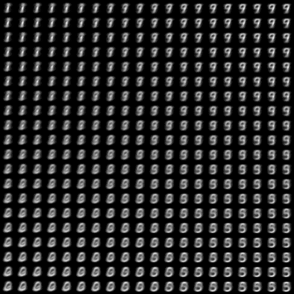
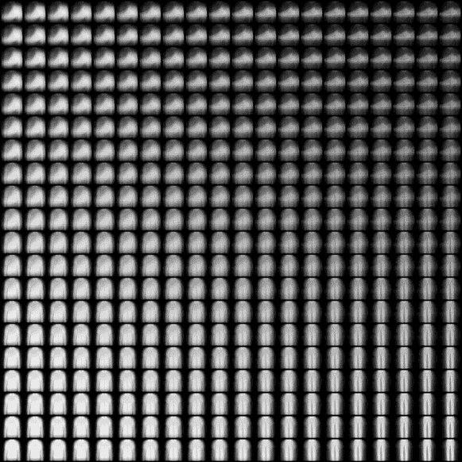

# Self-Organizing-Map-SOM
Pytorch implementation of Self-Organizing Map(SOM). Uses MNIST, Fashion-MNIST dataset as a demo.  


## Requirements  
Code is written in Python 3.6 and requires:  
* Pytorch 0.4.0+  
* Matplotlib  


## Run the example  

#### MNIST  
```
python main.py --train --mnist
```

#### Fashion-MNIST
```
python main.py --train --fashion_mnist
```
#### Color  
``` 
python main.py --train --color
```
  
 
## Results

#### MNIST
* Animation  

* Result Image  
  
  
  
  
#### Fashion-MNIST
  
* Animation  

* Result Image  


    
#### Color  
 