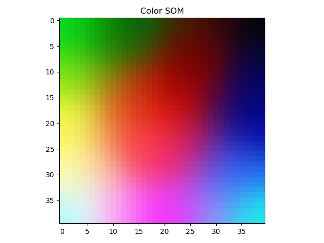
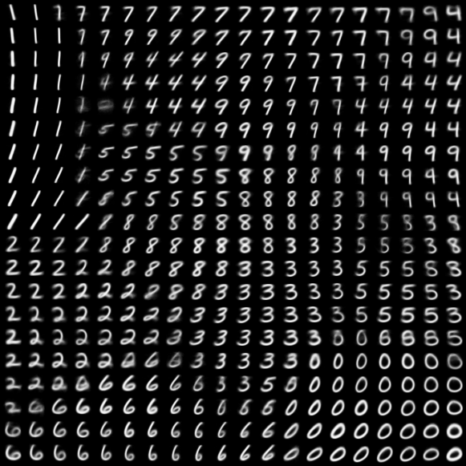
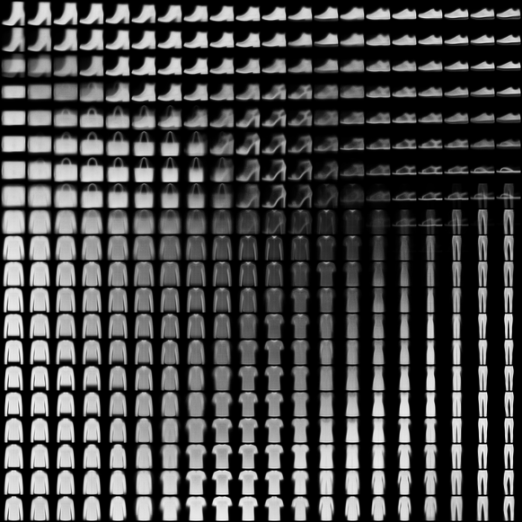

# Self-Organizing-Map-SOM
Pytorch implementation of Self-Organizing Map(SOM). Uses MNIST, Fashion-MNIST dataset as a demo.  

## Requirements  
Code is written in Python 3.6 and requires:  
> Pytorch  
> Matplotlib  

## Run the example
''' 
python main.py --train --color 
'''  

''' 
python main.py --train --mnist 
'''  

''' 
python main.py --train --fashion_mnist 
'''  

## Examples

  
  
  
